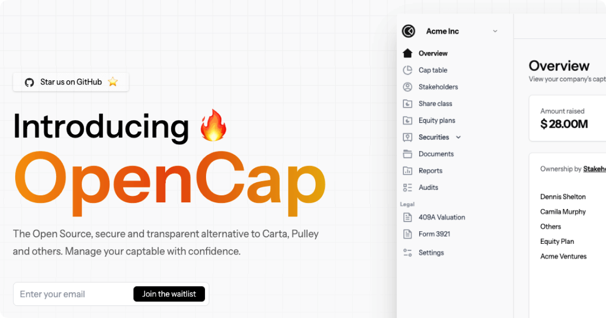

<h1 align="center">OpenCap</h1>
<p align="center">
  An open source alternative to <strong>Carta</strong> and <strong>Pulley</strong>
</p>
<p align="center">
  <a href="https://opencap.co"><strong>Learn more »</strong></a>
</p>

<p align="center">
  <a href="https://github.com/opencapco/opencap.co/stargazers">
    
  </a>
  <a href="https://twitter.com/opencapco">
    
  </a>
  <a href="https://github.com/opencapco/opencap.co/actions/workflows/deploy.yml">
    
  </a>
  <a href="https://github.com/opencapco/opencap.co/blob/main/LICENSE">
    
  </a>
  <a href="https://discord.gg/rCpqnD6G6p">
    
  </a>
</p>


OpenCap will follow the [Open Cap Table Coalition](https://www.opencaptablecoalition.com/format) format, an open source standard to prevent lock-in and keep lawyer fees low. No promises.

<h2 id="contributors">✨ Contributors</h2>

- Don't forget to leave a star ⭐️
- We ❤️ contributors! Feel free to contribute to this project!.
- Any contributions you make are truly appreciated.
- Let's continue contributing to keep the community active and growing.
- Let's collaborate on [Discord](https://discord.gg/rCpqnD6G6p) community channel.

<a href="https://github.com/opencapco/opencap.co/graphs/contributors">
  <p>
    
  </p>
</a>

## Stack
- [Next.js](https://nextjs.org)
- [NextAuth.js](https://next-auth.js.org)
- [Prisma](https://prisma.io)
- [Tailwind CSS](https://tailwindcss.com)
- [tRPC](https://trpc.io)
- [@shadcn/ui](https://ui.shadcn.com/)

## Developers

### With Docker
Follow the steps below to stand the app up locally.

**1. Install dependencies.**

```sh
npm i
```

**2. Copy `.env.example`**

```sh
cp .env.example .env
```

**3. Run docker to setup**
> If you prefer to run the app without docker, you can skip this step and configure the following services manually:

  * Postgres database
  * Minio storage
  * SMTP server 

```sh
npm run docker:start
```

Generate tables and the Prisma client.

```sh
npx prisma migrate dev
```

To see what's in your database, run Prisma Studio:

```sh
npm run db:studio

```

**4. Seed some data (For dev environment)**

```sh
npm run db:seed
```

**5. Run the web app**

```sh
npm run dev
```

**6. Install and run SMTP server**

> If you have setup database using docker, this step is optional.

> [Mailpit](https://github.com/axllent/mailpit) or something similar can be used intercept emails in development.

```sh
npm run email:dev
```

Open your browser to the URLs given by the web app and studio processes. You're up and running, good job! 🎉

#### Gitpod Setup

- Click the button below to open this project in Gitpod.

[](https://gitpod.io/#https://github.com/opencapco/opencap.co)

### One-click deploy

_Coming soon to a PaaS near you:_

### Vercel

[](https://vercel.com/new/git/external?repository-url=https://github.com/opencapco/opencap.co)

### Render

[](https://render.com/deploy?repo=https://github.com/opencapco/opencap.co)

### Railway

[](https://railway.app/new?template=)

### Netlify

[](https://app.netlify.com/start/deploy?repository=https://github.com/opencapco/opencap.co)
