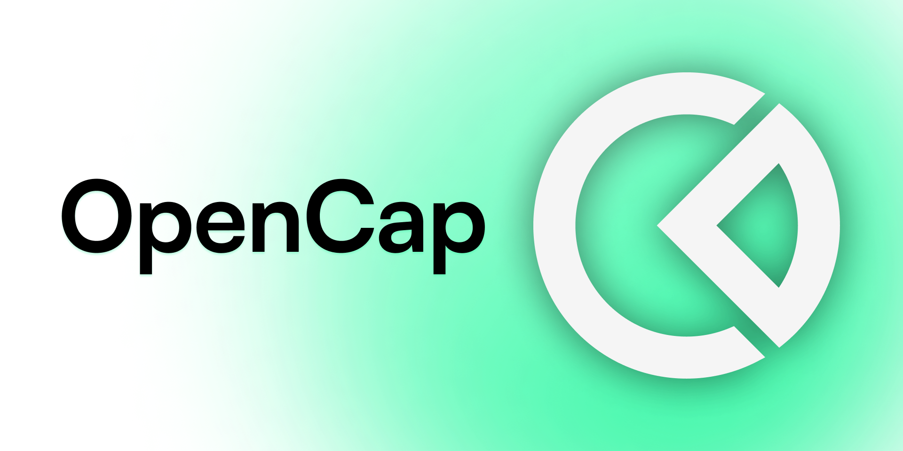

<picture>
  <source media="(prefers-color-scheme: dark)" srcset=".github/images/cover-dark.png">
  <source media="(prefers-color-scheme: light)" srcset=".github/images/cover-light.png">
  
</picture>


# OpenCap
**An open source alternative to [Carta](https://carta.com) and [Pulley](https://pulley.com).**

OpenCap will follow the [Open Cap Table Format](https://www.opencaptablecoalition.com/format), an open source standard to prevent lock-in and keep lawyer fees low. No promises.

## Built with

- [create-t3-stack](https://create.t3.gg/)
  - [Next.js](https://nextjs.org)
  - [NextAuth.js](https://next-auth.js.org)
  - [Prisma](https://prisma.io)
  - [Tailwind CSS](https://tailwindcss.com)
  - [tRPC](https://trpc.io)
- [@shadcn/ui](https://ui.shadcn.com/)
- [MailHog](https://github.com/mailhog/MailHog)

## Developers

Follow the steps below to stand the app up locally.

**1. Install dependencies.**

```sh
npm i
```

**2. Spin up a local database.**

First, ensure Docker is running.

```sh
npm run docker:start
```

Generate tables and the Prisma client.

```sh
npx prisma migrate dev
```

To see what's in your database, run Prisma Studio:

```sh
npm run db:studio
```

**3. Run the web app**

```sh
npm run dev
```

Open your browser to the URLs given by the web app and studio processes. You're up and running, good job! 🎉

### One-click deploy

_Coming soon to a PaaS near you:_

- [Vercel](https://vercel.com/new/git/external?repository-url=https://github.com/opencapco/opencap.co)
- [Render](https://render.com/deploy?repo=https://github.com/opencapco/opencap.co)
- [Railway](https://railway.app/new?template=)
- [Netlify](https://app.netlify.com/start/deploy?repository=https://github.com/opencapco/opencap.co)
